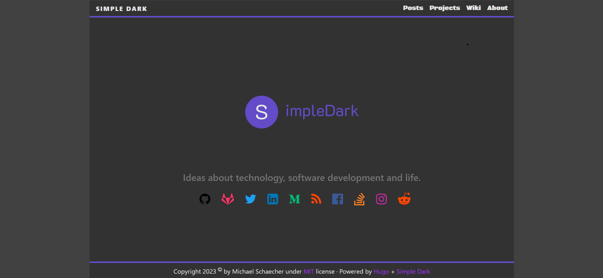

<!-- Use html to set the theme name, style and center -->
<div align="center">
  <h1 style="font-size: 3em; font-weight: bold; color: rgb(175, 145, 175);">Simple Dark</h1>
  <h2 style="font-size: 1.5em; color: rgb(100, 100, 100);"> A dark theme for <a
      href="https://www.hugo.com"
      style="color: rgb(150, 150, 150); text-decoration: none">Hugo</a> static site generator.
  </h2>
</div>

<!-- Table of contents -->

## Table of contents

- [About](#about)
- [Features](#features)
- [Installation](#installation)
  - [Clone](#clone)
  - [Submodule](#submodule)
- [Configuration](#configuration)

## About

**Simple Dark** is a simple dark theme for [Hugo](https://gohugo.io/). It is based on the [Coder](https://github.com/luizdepra/hugo-coder/) theme by **Luiz de Prá** because of its simplicity in design. After making some changes to the theme I realized that I had changed enough to make it a new theme. So I decided to share it with the community.

<!-- Using html to set image size and alignment -->
<div align="right">
  <a href="https://simple-dark.pages.dev/">
    </img>
    <figcaption>Live demo of theme host on Cloudflare pages</figcaption>
  </a>
</div>

## Features

- Responsive
- Dark mode
- Syntax highlighting
- Analytics
- Comments with hugo compatible commenting systems.
- Social links using [Font Awesome](https://fontawesome.com/) version 5.15.3
- Image management with captions.

## Installation

You can install the theme either as a clone or submodule if you are using git or you can download the theme as a zip file. I recommend using git to install via a submodule because it makes it easier to update the theme.

### Clone

```console
# Clone the theme to the themes directory
git clone https://github.com/MichaelSchaecher/simple-dark.git themes/simple-dark
```

### Submodule

Install the theme as a submodule is preferred that way if you make changes to the theme it well not be tracked by git.

```console
# Add the theme as a submodule
git submodule add https://github.com/MichaelSchaecher/simple-dark.git themes/simple-dark
```

## Configuration

