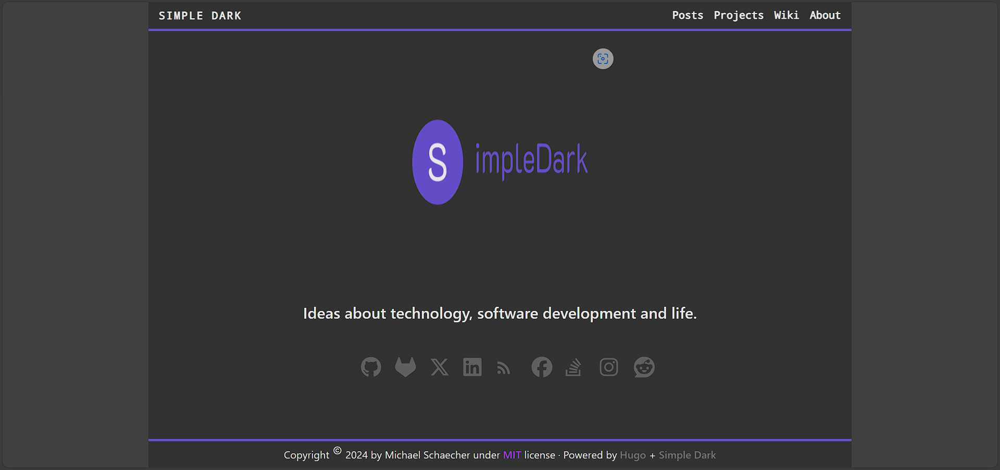

<!-- Use html to set the theme name, style and center -->
<a id="top"></a>
<div align="center">
  <h1 style="font-size: 3em; font-weight: bold; color: rgb(175, 145, 175);">Simple Dark</h1>
  <h2 style="font-size: 1.5em; color: rgb(100, 100, 100);"> A dark theme for <a
      href="https://www.gohugo.io/"
      style="color: rgb(150, 150, 150); text-decoration: none">Hugo</a> static site generator.
  </h2>
</div>

<!-- Table of contents -->

- [About](#about)
  - [Live Demo](#live-demo)
- [Features](#features)
- [Installation](#installation)
  - [Clone](#clone)
  - [Submodule](#submodule)
- [Configuration](#configuration)
  - [Site Parameters](#site-parameters)
  - [Markdown Parameters](#markdown-parameters)
  - [Author, Description and Keywords](#author-description-and-keywords)
  - [Font Awesome](#font-awesome)
  - [Licensing](#licensing)
  - [See Also](#see-also)
  - [Custom SCSS](#custom-scss)
  - [Analytics](#analytics)
  - [Content-Security-Policy](#content-security-policy)
  - [Social and Contact Links](#social-and-contact-links)
  - [Taxonomies](#taxonomies)
  - [Navigation Menu](#navigation-menu)
- [License](#license)

## About

**Simple Dark** is a simple dark theme for [Hugo](https://gohugo.io/). It is based on the [Coder](https://github.com/luizdepra/hugo-coder/) theme by **Luiz de Prá** because of its simplicity in design. After making some changes to the theme I realized that I had changed enough to make it a new theme. So I decided to share it with the community.

<!-- Using html to set image size and alignment -->
<div id="live-demo" align="right">
  <a href="https://simple-dark.pages.dev/">
    </img>
  </a>
    <figcaption>Live demo of theme host on Cloudflare pages</figcaption>
</div>

## Features

- Responsive
- Dark mode
- Syntax highlighting
- Analytics
- Comments with hugo compatible commenting systems.
- Social links using [Font Awesome](https://fontawesome.com/) icons via icon kit.
- Image management with captions.

## Installation

You can install the theme either as a clone or submodule if you are using git or you can download the theme as a zip file. I recommend using git to install via a submodule because it makes it easier to update the theme.

### Clone

``` console
git clone https://github.com/MichaelSchaecher/simple-dark.git themes/simple-dark
```

### Submodule

Install the theme as a submodule is preferred that way if you make changes to the theme it well not be tracked by git.

```console
# Add the theme as a submodule
git submodule add https://github.com/MichaelSchaecher/simple-dark.git themes/simple-dark
```

## Configuration

After installing the theme you well need to configure inorder to use it. The following configuration are in `yaml` format, because I find it easier to read. If you prefer `toml` or `json` you can convert the configuration to the format you prefer.

> **NOTE:** For now the right-to-left (RTL) is not supported. I am working on adding support for RTL, but as I'm not bilingual it is taking me longer than I would like.

### Site Parameters

The following are the site parameters that you can set in the `config.yaml` file.

```yaml
# config.yaml
baseURL: "/"
title: Your site title
theme: simple-dark
languageCode: en
defaultContentLanguage: en

# How many posts to show on the home page; the default is 10 and the maximum is 100.
paginate: 20
```

### Markdown Parameters

By default [Hugo](https://gohugo.io/) does not render html in markdown files. To enable html rendering you need to set the `unsafe` parameter to `true` in the `config.yaml` file. I also recommend setting the `endLevel` parameter to `4` and the `startLevel` parameter to `2` in the `config.yaml` file. This well set the table of contents to start at the `h2` level and end at the `h4` level.

```yaml
markup:
  goldmark:
    renderer:
      unsafe: true
  tableOfContents:
    endLevel: 4
    ordered: true
    startLevel: 2
  highlight:
    noClasses: false
```

### Author, Description and Keywords

The following are the author, description and keywords parameters that you can set.

```yaml
params:
  author: Your name
  description: Your site description
  keywords: Your site keywords
```

### Licensing

The theme supports link to the license type in the footer. You can set the license type and location under the `params` section.

```yaml
params:

# ---

  license:
    type: MIT
    location: link to license
```

### See Also

`maxSeeAlsoItems: 1` is the maximum number of see also items to show in the sidebar. The default is `5` and the maximum is `10`.
This is used to show series the post is part of.

Because of how posts are rendered in [Hugo](https://gohugo.io/) you need to add the following to the front matter of each post you want to be part of a series.

Post front matter:

```yaml
series:
  - name: Series Name
    weight: 1
```

### Font Awesome

The theme uses [Font Awesome](https://fontawesome.com/) icons via the icon kit. You can enable the icon kit by setting the `fontawesomeKit` parameter to the kit code.

You well need to sign up for a free account to get the kit code. The advantage of using the kit code is that you can use the latest icons and you can use the icons in your site without the need to download the icons to your site.

### Custom SCSS

Using a custom `scss` maybe enabled by setting the `customSCSS` parameter to the relative path. This means the `scss` file must be in the `assets` or `static` directory. However, if you are using a `scss` file in the `assets` directory you may just want to import the `scss` file by copying the `theme/simple-dark/assets/scss/simple-dark.scss` file to your `assets/scss` directory and adding `@import "simple-dark";` at the bottom.

Keep in mind that if you do copy the file, you well need to use the same relative path as the original file. For example, `theme/simple-dark/assets/scss/simple-dark.scss` would be `assets/scss/simple-dark.scss`. Not doing so well cause the theme to not render correctly or build errors.

```yaml
params:

# ---

  customSCSS: "scss/custom.scss"
```

### Analytics

The theme supports Google Analytics, Plausible and Simple Analytics. You can enable the analytics by setting the `analytics` parameter to the name of the analytics you want to use. You can also set the `analyticsID` parameter to the ID of the analytics you want to use.

However, some hosting providers like [Cloudflare Pages](https://pages.cloudflare.com/) provide analytics without the need to configure with the theme, otherwise set the `analyticsID` parameter to the ID of the analytics you want to use.

- [goatCounter](https://goatcounter.com/)
  - `code: goatcounter`
- [googleAnalytics](https://analytics.google.com/)
  - `id: UA-XXXXXXXXX-X`
- [matomo](https://matomo.org/)
  - `siteID: 1`
  - `serverURL: https://example.com/matomo/`
- [yandexMetrika](https://metrika.yandex.com/)
  - `id: XXXXXXXX`
- [cloudflare](https://www.cloudflare.com/)
  - `id: XXXXXXXX`
- [plausibleAnalytics](https://plausible.io/)
  - `domain: example.com`
  - `serverURL: https://example.com`
  - `outboundLinksTracking: true`
  - `fileDownloadsTracking: true`
- [applicationInsights](https://azure.microsoft.com/en-us/services/monitor/)
  - `connectionString: XXXXXXXX`
- [microAnalytics](https://microanalytics.io/)
  - `id: XXXXXXXX`
  - `dnt: false`
- [pirsch](https://pirsch.io/)
  - `code: XXXXXXXX`

### Content-Security-Policy

Content-Security-Policy (CSP) is a security feature that helps prevent cross-site scripting (XSS) attacks. The theme supports CSP by setting the `csp` parameter to the CSP you want to use. However, some hosting providers like [Cloudflare Pages](https://pages.cloudflare.com/) [github pages](https://pages.github.com/) and [netlify](https://www.netlify.com/) provide CSP without the need to configure with the theme.

This is more useful if you are hosting your site on your own server.

```yaml
params:

# ---

  csp:
    childsrc: [self]
    fontsrc: [self, https://fonts.gstatic.com, https://cdn.jsdelivr.net/]
    formaction: [self]
    framesrc: [self, https://www.youtube.com]
    imgsrc: [self]
    objectsrc: [none]
    stylesrc: [self,unsafe-inline,https://fonts.googleapis.com/,https://cdn.jsdelivr.net/]

    scriptsrc: [self,unsafe-inline,https://www.google-analytics.com,https://cdn.jsdelivr.net/]
```

You may to edit the CSP to fit your needs. For more information on CSP see [Content-Security-Policy](https://developer.mozilla.org/en-US/docs/Web/HTTP/CSP).

### Social and Contact Links

The theme uses **font awesome** icons for the social and contact links. Because of the default fonts for **smart phones** and **tablets** and older version is used, otherwise the icons well not render correctly.

Use the `social` icons that you want. For using rss feed you need to set the `rel` and `type` parameters.

```yaml
params:

---

social:
    - name: github
      icon: fa fa-2x fa-github
      url: https://github.com/MichaelSchaecher/
    - name: Gitlab
      icon: fa fa-2x fa-gitlab
      url: https://gitlab.com/
    - name: Twitter
      icon: fa fa-2x fa-twitter
      url: https://twitter.com/
    - name: LinkedIn
      icon: fa fa-2x fa-linkedin
      url: https://www.linkedin.com/
    - name: Medium
      icon: fa fa-2x fa-medium
      url: https://medium.com/
    - name: RSS
      icon: fa fa-2x fa-rss
      url: https://myhugosite.com/
      rel: alternate
      type: application/rss+xml
    - name: Facebook
      icon: fa fa-2x fa-facebook-official
      url: https://www.facebook.com/
    - name: StackOverflow
      icon: fa fa-2x fa-stack-overflow
      url: https://stackoverflow.com/
    - name: Instagram
      icon: fa fa-2x fa-instagram
      url: https://www.instagram.com/
```

### Taxonomies

Taxonomies are used to group content together: the only one that is required is `series`, if using the default `layout/post/single.html`. However, you can use any taxonomy you want by setting the `taxonomies` parameter to the taxonomy you want to use.

```yaml
params:

# ---

  taxonomies:
    series: series
    tag: tags
    category: categories
    authors: authors
```

## Navigation Menu

The navigation menu is generated from the `config.yaml` file. The menu is generated from the `main` menu. You can add menu items by adding the following to the `config.yaml` file.

```yaml
params:

# ---

  menu:
    main:
      - name: Posts
        url: /posts/
      - name: Wiki
        url: /wiki/
      - name: Projects
        url: /projects/
      - name: About
        url: /about/
      - name: Contact
        url: /contact/
```

[Back to top](#top)

## License

The theme is released under the [MIT](COPYING) license.
